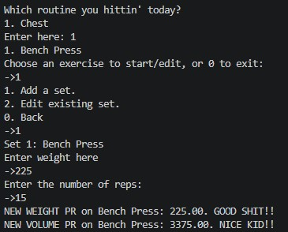

# Workout Log CLI Application
A CLI workout logging application made in java. Allows users to track training sessions, monitor progress and create custom exercises.
## 🚀 Features
- Create workout routines.
- Log workout sessions with reps, sets, and weight.
- Track personal records (PR's) for weight and volume.
- Create and manage custom exercises
- Modular structure designed for future scalability
  
## 🏗️ Architecture
The project is organized into the following packages:

- **gainengine.logic**:
  Business logic and object creation  
  (e.g., `ExerciseFactory`, `ExerciseLibrary`)
- **gainengine.model**: 
  Core domain models representing the application data  
  (e.g., `Exercise`, `WorkoutSession`, `WorkoutSet`)
- **gainengine.storage**: 
  handles the persistence/saving of application data. 
- **gainengine.ui**:
  CLI interface for user interaction
- **gainengine.utils**:
  Utility classes for reusable logic
- **gainengine.test**: Experimental and test code (work in progress)
  

## 🧠 Design Decisions
- Each exercise is uniquely identified using a stable ID (UUID for custom exercises, enum-based for predefined ones)
- Clear separation between:
  - Exercise → the template (name, description, muscles)
  - Performed data → stored within workout sessions (sets, reps, weight) 
- **Focus on seperation of concerns for future expansion**

## ▶️ How to Run
- 1. Clone the repository:
``` bash
git clone https://github.com/PhiltheThrill29034/WorkoutLog.git

```

- 2. Compile all `.java` files in your IDE (IntelliJ/Eclipse) or using your terminal.

- 3. Run the application by executing the `WorkoutApp` main class.

## 📸 Demo

  


## 📌 Future Improvements
- **Short-Term**
  - Persist WorkoutRoutine objects
  - Refactor and simplify the WorkoutApp entry point
  - Maven build
- **Long-Term**
  - Expose functionality via a REST API
  - Rebuild the application using Spring Boot
  - Add a database layer (e.g., PostgreSQL)
  - Introduce authentication and user profile


### Personal Note 🗒️
I built this project to push myself as a Java developer while balancing my Computer Science studies.

It’s a practical step in my journey toward becoming a better programmer, building more maintainable software and understanding real-world application design.